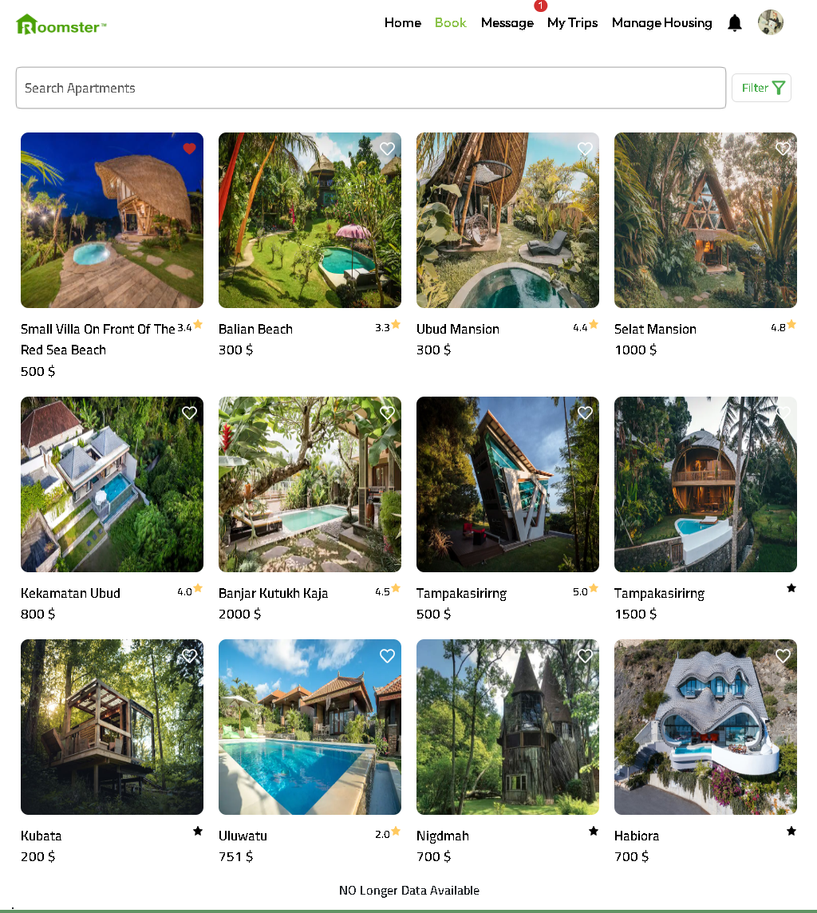
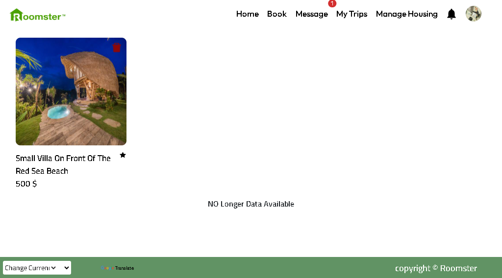
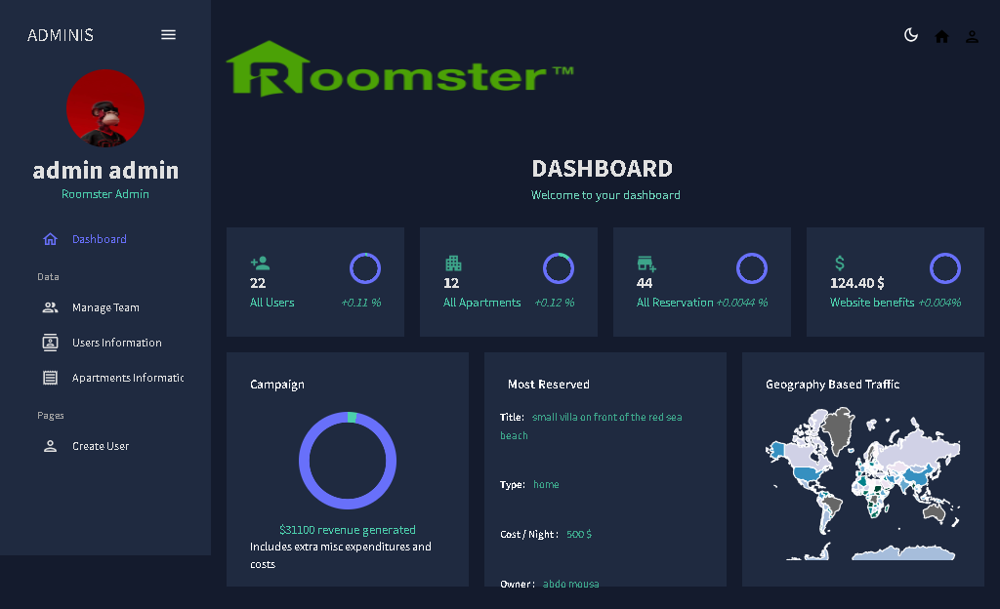
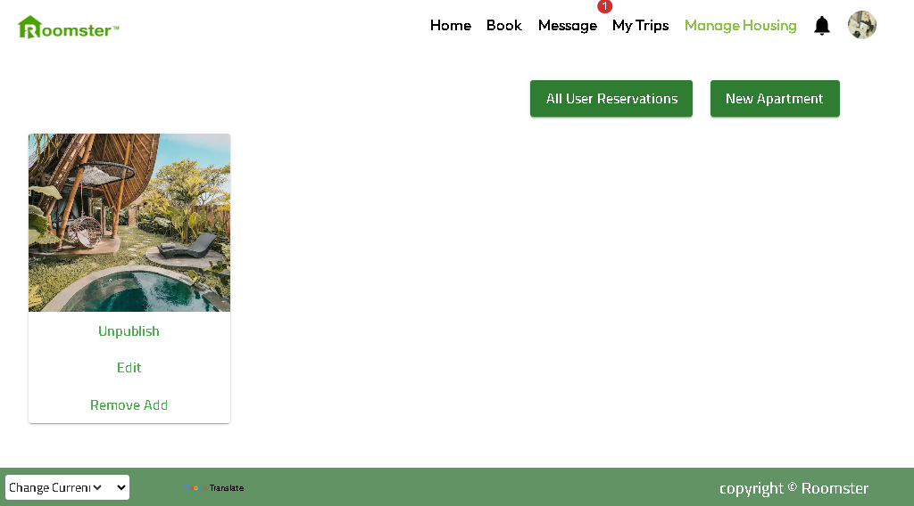
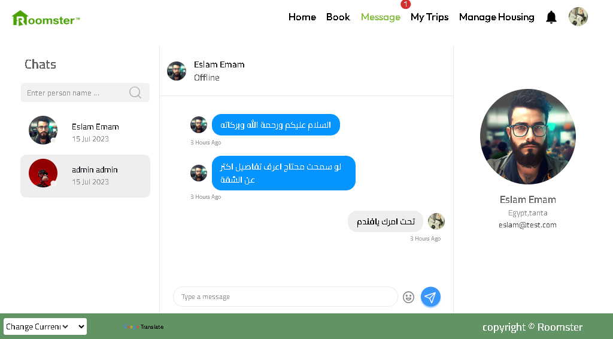

# Roomster
Roomster is a website that allows users to find and book vacation rentals, similar to Airbnb. This README file provides an overview of the project and instructions on how to set it up and use it.

# Features
* Search for rental properties: Users can search for rental properties by specifying the location, date range, number of guests, and price range they're looking for. The search results will show them a list of properties that match their criteria.
* View property details: Users can view detailed information about each property, including photos, descriptions, amenities, and reviews from previous guests. This will help them make an informed decision about which property to book.
* Book a property: Users can book a property by selecting the dates and number of guests they need, and paying for the booking with a credit card. This ensures that the booking process is smooth and hassle-free.
Chat system, any user can message the host if he needs to inquire about anything
* Create an account: Users can create an account to save their favorite properties, view their booking history, and manage their profile information. This makes it easier for them to keep track of their bookings and preferences.
* List properties for rent: Hosts can list their properties for rent on the website, set prices and availability, and manage bookings and payments. This allows them to earn money by renting out their properties to travelers.

# Technologies Used
* Front-end: HTML, CSS, JavaScript, React.js , material ui , redux toolkit , socket io
* Back-end: Node.js, Express.js, MongoDB , mongoose , socket io
* Payment processing: Stripe API
# Demo

